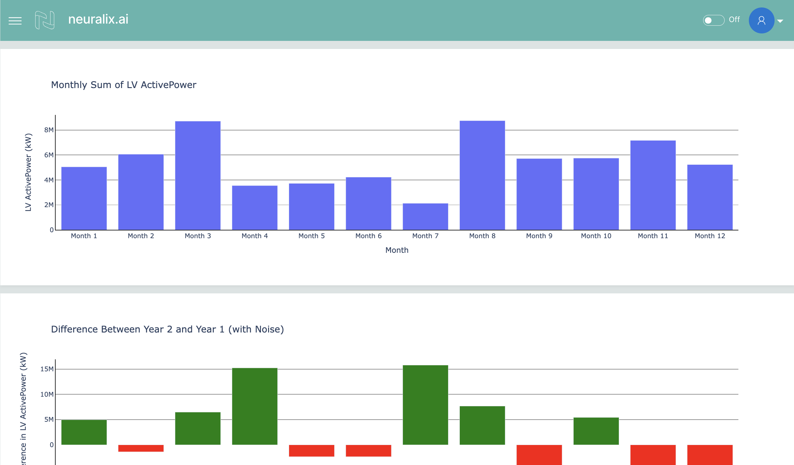

# Neuralix AI Dashboard

A hackathon submission



## 🎒 Tech Stack


</img>

## 🖥️ Run Locally

Clone the project

```bash
  git clone https://github.com/Rajkanwars15/WindmillDashboard
```

Go to the project directory

```bash
  cd neuralix-ai-hackathon-task1
```

Create a virtual environment

```bash
cd waveton/apps/visualization_apps/image_augmentation
python3 -m venv venv
source venv/bin/activate
```

Install the packages

```bash
python3 -m pip install --upgrade pip
python3 -m pip install -r requirements.txt
```

Run the application

```bash
cd src
```
```bash
wave run app
```

The Wave server should now be running at http://localhost:10101.

Project Organization
------------

    .
    ├── Hackathon_Dashboard                                         <- Resources given by neuralix
    │   ├── DashboardReferences
    │   ├── Data
    │   ├── Notebooks
    │   ├── Output
    │   ├── PythonPlots
    │   └── README.md
    ├── JupyterOutputs                                              <- Outputs generated in Jupyter Notebooks stored as html
    │   ├── difference_between_year_2_and_year_1_.html
    │   ├── failures_by_model.html
    │   ├── gps_coordinates_visualization.html
    │   ├── mean_time_until_failure_by_machine_model.html
    │   ├── monthly_sum_of_lv_activepower.html
    │   ├── quarterly_summary_of_changes.html
    │   ├── stacked_time_series_plot.html
    │   ├── time_series_data_with_threshold.html
    │   ├── top_3_root_causes_of_failure.html
    │   └── turbine_bearings_status.html
    ├── resources
    │   ├── Screenshots
    │   └── logo
    ├── src                                                         <- Working directory of the H2O App
    │   ├── app.py                                            <- Python script defining the main functionality of the Wave app.
    │   └── cards.py                                          <- Python script defining UI components (cards) for the Wave app.
    ├── LICENSE                                                     <- Project license
    ├── README.md                                                   <- The top-level README for developers using this project.
    ├── Steps.md                                                    <- Steps followed for implementation
    └── requirements.txt                                            <- The requirements file for reproducing the analysis environment


--------

<p><small>Generate fresh structure with</small></p>
<small>

```
tree -L 2 --dirsfirst
```
</small>


## 👨‍💻 Author

[
](https://www.github.com/rajkanwars15)